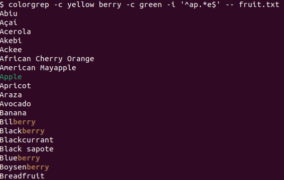

# colorgrep

Reads from stdin and highlights any matched patterns

## Usage

    colorgrep [options] <pattern> [[-i] [-w] [-c <color>] <pattern> [...]]
      -i           case insensitive matching
      -w           word boundary matching
      -c <color>   color to highlight match
      -e <pattern> use pattern (useful for patterns starting with a hyphen)
      -h, --help   display this help

## Example

    cat fruit.txt | colorgrep -c yellow berry -c green -i '^ap.*e$'

Which will highlight matches:

## Download

intel-linux users:

    sudo /bin/sh -c ' wget https://github.com/alexcb/colorgrep/releases/latest/download/colorgrep-linux-amd64 -O /usr/local/bin/colorgrep && chmod +x /usr/local/bin/colorgrep'

raspberrypi-v4-linux users:

    sudo /bin/sh -c ' wget https://github.com/alexcb/colorgrep/releases/latest/download/colorgrep-linux-arm64 -O /usr/local/bin/colorgrep && chmod +x /usr/local/bin/colorgrep'

intel-mac users:

    sudo /bin/sh -c ' wget https://github.com/alexcb/colorgrep/releases/latest/download/colorgrep-darwin-amd64 -O /usr/local/bin/colorgrep && chmod +x /usr/local/bin/colorgrep'

m1/2-mac users:

    sudo /bin/sh -c ' wget https://github.com/alexcb/colorgrep/releases/latest/download/colorgrep-darwin-arm64 -O /usr/local/bin/colorgrep && chmod +x /usr/local/bin/colorgrep'

## Building

First download [earthly](https://github.com/earthly/earthly).

Then run:

    earthly +colorgrep-all

builds are written to `build/<OS>/<arch>/colorgrep` (where `OS` is either `linux` or `darwin` (MacOS), and `arch` is either `amd64` (intel-based) or `arm64` (M1, raspberry pi v4, etc))

## Licensing
colorgrep is licensed under the Mozilla Public License Version 2.0. See [LICENSE](LICENSE).
